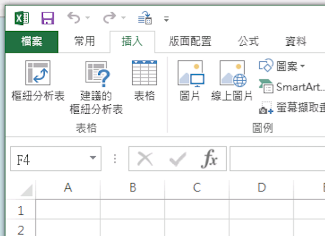

```{r setup, include=FALSE, cache=FALSE}
library(knitr)      # dynamic report generation, RMarkdown
library(ggplot2)    # data Viz
library(reshape2)   # long and wide format
library(data.table)   # long and wide format
library(dplyr)
options(width = 100)
opts_chunk$set(echo = TRUE, comment="", message=FALSE, warning=FALSE)
```

[Contact](mailto:snexuz@gmail.com)｜[Linkedin](http://tw.linkedin.com/in/rafechliu)

# 0. R-Review

### 最重要的小事
- 程式『語言』

- Working directory 
    - `getwd()`: get working directory
    - `setwd()` 
    
- 讀檔之前，先觀察檔案
    - 編碼通常都是 `UTF8` 或 `BIG5`
    - Linux, Darwin: "UTF-8"
    - Windows: "BIG-5"
    
- library function
    - 依照不同檔案格式選擇
    - `readLines`, `read.csv`....
    
### Packages for today
- 套件安裝 / `install.packages()`
    - magrittr
    - dplyr
    - reshape2

- 載入套件 / `library("package.name")`

### read data
- Concept
```{r,echo=TRUE,eval=FALSE}
raw <- readLines('檔案路徑', encoding = "BIG-5")
```

- Tips: 轉換編碼並存檔
```{r,echo=TRUE,eval=FALSE}
# 從big5轉utf8
raw2 <- iconv(raw, from = "BIG-5", to = "UTF-8")

# 存檔囉～～
write.csv(file = "ubikeweatherutf8.csv", x = raw2, fileEncoding = "UTF-8")
```

### 本日資料檔
ubike x weather 資料檔(右鍵另存新檔)

   - [big5 (WIN)](https://github.com/snexuz/2016DSP_dplyr/raw/master/data/ubike-weather-big5.csv)
   - [utf8 (MAC, LINUX)](https://github.com/snexuz/2016DSP_dplyr/raw/master/data/ubike-weather-utf8.csv)

```{r, echo=TRUE, eval=FALSE}
# 必先確認 Working Directory!
# getwd(), setwd()

# read.csv
ubike <- read.csv(file = "./data/ubike-weather-big5.csv",
          colClasses = c("factor","integer","integer","factor","factor",
                         "numeric","numeric","integer","numeric","integer",
                         "integer","numeric","numeric", "integer","integer",
                         "numeric","numeric","numeric", "numeric","numeric",
                         "numeric", "numeric","numeric"), 
          fileEncoding = 'BIG-5',
          stringsAsFactors = F)

# 以 colClasses 控制每個欄位的 class，這可使讀檔加速
# 以 fileEncoding 定義檔案編碼

```

### 把欄位換成中文
- `CAUTION!: 雖然欄位名稱可以換成中文，但是不建議`
```{r, echo = TRUE, cache=TRUE, message=FALSE, eval=FALSE}
colnames(ubike) <- c("日期","時間","場站代號","場站區域","場站名稱",
                     "經度","緯度","總停車格","平均車輛數","最大車輛數",
                     "最小車輛數","車輛數標準差","平均空位數","最大空位數","最小空位數",
                     "空位數標準差","氣溫","最高溫","最低溫","溼度",
                     "氣壓","最大風速","降雨量")
```

- 欄位中文英文對照表
```{r results='asis'}
ubike <- read.csv(file = "./data/ubike-weather-big5.csv",
          colClasses = c("factor","integer","integer","factor","factor",
                         "numeric","numeric","integer","numeric","integer",
                         "integer","numeric","numeric", "integer","integer",
                         "numeric","numeric","numeric", "numeric","numeric",
                         "numeric", "numeric","numeric"), 
          fileEncoding = 'BIG-5',
          stringsAsFactors = F)

chin <- c("日期","時間","場站代號","場站區域","場站名稱","經度","緯度",
          "總停車格","平均車輛數","最大車輛數","最小車輛數","車輛數標準差","平均空位數","最大空位數",
          "最小空位數","空位數標準差","氣溫","最高溫","最低溫","溼度","氣壓",
          "最大風速","降雨量")

coln <- data.frame(matrix(data="", ncol=4, nrow=11), stringsAsFactors = FALSE)
coln$X1 <- chin[1:11]
coln$X2 <- colnames(ubike)[1:11]
coln$X3[1:10] <- chin[12:21]
coln$X4[1:10] <- colnames(ubike)[12:21]
```

```{r, echo=FALSE}
knitr::kable(coln, col.names = c("欄位名稱","代號","欄位名稱","代號"))
```

### 取值- 座標
```{r echo=TRUE, eval=FALSE}
# structure, summary of ubike dataset
str(ubike)

# head可以取出前幾列
head(ubike)

# tail可以取最後幾列
tail(ubike)

# 利用座標來取值，第一個數表示列位，第二個數表示欄位
ubike[3,2]

# 可一次選擇多列多欄
ubike[c(3:4), c(2:5,7)]

# 加上負號可剔除列位欄位
ubike[c(3:4), -c(6:21)]
```

### 取值- 指定欄位
```{r echo=TRUE,eval=FALSE}
ubike[,4]

ubike[,"sna"]

ubike[["sna"]]

ubike$場站名稱
```

<br>

<b> Quiz: </b> 
以下顯示？
```{r echo=TRUE,eval=FALSE}
ubike[ubike$sna %in% c("台北市災害應變中心", "世貿三館"), ]

```

# 1. Manipulate data: ETL
## 1.1. magrittr, dplyr

- 壓縮的程式碼不好讀
- 展開的程式碼會產生很多暫存變數
- 套件 `magrittr` 解決了這個問題
- Pipeline style

```{r magrittr, echo = TRUE, results='hide'}
# OLD school
ans1 <- ubike$sna
ans1.1 <- unique(ans1) # unique可列出所有不重複的項目
print(head(ans1.1, n = 10))

# pipeline style
library(magrittr)
ubike$sna %>%
  unique() %>% head(n = 10) %>%
  print()

```

<br>

</img>

<br>

### dplyr

- 讓 R 使用者可以用更有彈性的方式來處理資料
- 整合 `magrittr` pipeline
- 針對 `data.frame` 做設計（名稱中的`d`）
- 設計理念
    - Step by step
    - 處理速度直覺又快
    - 支援異質資料源（`data.frame` 或資料庫中的表格）
    - 結合資料整理工具優點（ex. Excel, SQL）


### 官方文件：`vignette`
- 更詳細的 dplyr 介紹可以閱讀 dplyr 的小論文
- R 的開發者會針對一個主題撰寫小論文做介紹

```{r dplyr-vignette, echo = TRUE, eval=FALSE}
vignette(all = TRUE, package = "dplyr")

vignette("introduction", package = "dplyr")

```

### dplyr 常用指令

- `filter` 對列做篩選
- `select` 對欄做篩選
- `mutate` 更改欄或新增欄
- `arrange` 排列
- `group_by`+`summarise` 依照類別處理
- 合併欄位


## 1.2. 範例實作
小明想在永和找到新房子，希望以後上下班都靠 ubike 通勤，希望早上可以輕鬆租到車，下班後也可以輕鬆還車。
- 請幫他找出中和區早上七點腳踏車最多的場站。
- 比較 `mutate()` 與 `summarise()` 之不同

```{r echo = TRUE, eval=FALSE}
library(dplyr)

head(ubike)

select(ubike, hour, sarea, sna, avg.sbi) %>%
  filter(sarea == '中和區' & hour == 7) %>%
  mutate(avg.sbi = floor(avg.sbi)) 

select(ubike, hour, sarea, sna, avg.sbi) %>%
  filter(sarea == '中和區' & hour == 7) %>%
  group_by(hour, sarea, sna) %>%
  summarise(avg = mean(avg.sbi) %>% round()) %>%
  arrange(avg %>% desc())
```


### select
```{r, echo = TRUE, eval = FALSE}
select(ubike, hour, sarea, sna, avg.sbi) 
```

</img>
</img>

<br>

- 「選擇」時間、場站區域、場站名稱、平均車輛數

```{r, echo = FALSE}
select(ubike, hour, sarea, sna, avg.sbi) %>%
  head() %>% knitr::kable()
```


### filter
```{r, echo = TRUE, eval = FALSE}
select(ubike, hour, sarea, sna, avg.sbi) %>%
  filter(sarea == '中和區' & hour == 7) 
```

<br>

</img>
</img>

<br>

- 「篩選」出中和區的資料

```{r, echo = FALSE}
select(ubike, hour, sarea, sna, avg.sbi) %>%
  filter(sarea == '中和區' & hour == 7) %>%
  knitr::kable()
```


### mutate
```{r, echo = TRUE, eval = FALSE}
select(ubike, hour, sarea, sna, avg.sbi) %>%
  filter(sarea == '中和區' & hour == 7) %>%
  mutate(avg.sbi = floor(avg.sbi)) 
```

<br>

</img>
</img>

<br>

- 「變化」新增欄位以計算有車率

```{r, echo = FALSE}
select(ubike, hour, sarea, sna, avg.sbi) %>%
  filter(sarea == '中和區' & hour == 7) %>%
  mutate(avg.sbi = floor(avg.sbi)) %>%
  knitr::kable()
```

### group_by
```{r, echo = TRUE, eval = FALSE}
select(ubike, hour, sarea, sna, avg.sbi) %>%
  filter(sarea == '中和區' & hour == 7) %>%
  group_by(hour, sarea, sna)
```

<br>

</img>
</img>

<br>

- 將資料依照某變數組成「群組」

```{r, echo = FALSE}
select(ubike, hour, sarea, sna, avg.sbi) %>%
  filter(sarea == '中和區' & hour == 7) %>%
  group_by(hour, sarea, sna) %>%
  knitr::kable()
```


### summarise
```{r, echo = TRUE, eval = FALSE}
select(ubike, hour, sarea, sna, avg.sbi) %>%
  filter(sarea == '中和區' & hour == 7) %>%
  group_by(hour, sarea, sna) %>%
  summarise(avg = mean(avg.sbi) %>% round())
```

<br>

</img>
</img>
</img>

<br>

- 針對各組進行計算

```{r, echo = FALSE}
select(ubike, hour, sarea, sna, avg.sbi) %>%
  filter(sarea == '中和區' & hour == 7) %>%
  group_by(hour, sarea, sna) %>%
  summarise(avg = mean(avg.sbi) %>% round()) %>%
  knitr::kable()
```

### arrange
```{r, echo = TRUE, eval = FALSE}
select(ubike, hour, sarea, sna, avg.sbi) %>%
  filter(sarea == '中和區' & hour == 7) %>%
  group_by(hour, sarea, sna) %>%
  summarise(avg = mean(avg.sbi) %>% round()) %>%
  arrange(avg %>% desc())
```

<br>

</img>
</img>

<br>

```{r, echo = FALSE}
select(ubike, hour, sarea, sna, avg.sbi) %>%
  filter(sarea == '中和區' & hour == 7) %>%
  group_by(hour, sarea, sna) %>%
  summarise(avg = mean(avg.sbi) %>% round()) %>%
  arrange(avg %>% desc()) %>%
  knitr::kable()
```


<hr>

<b> Quiz: </b>
小明發現住信義區的話，八點騎腳踏車就可以準時上班，還可以順便吃早餐，請幫忙找出信義區各車站八點車子最多的站

```{r, echo = FALSE}
select(ubike, hour, sarea, sna, avg.sbi) %>%
  filter(sarea == '信義區' & hour == 8) %>%
  group_by(hour, sarea, sna) %>%
  summarise(avg = mean(avg.sbi) %>% round()) %>%
  arrange(avg %>% desc()) %>%
  knitr::kable()
```

<br>

<b> Quiz: </b>
小明喜歡玩遙控飛機，在中和希望找一個下午三點風比較小的地點吧

```{r, echo = FALSE}
select(ubike, hour, sarea, sna, max.anemo, lng, lat) %>%
  filter(sarea == "汐止區", hour == 15) %>%
  group_by(sna) %>%
  summarise(avg_anemo = mean(max.anemo, na.rm = T)) %>%
  arrange(avg_anemo) %>%
  knitr::kable()
```


### bind
- `bind_rows(a,b)`
- `bind_cols(a,b)`

<br>

</img>
</img>

<br>

</img>
</img>

<br>


- bind_rows
```{r echo=TRUE, warning=F}
V1 <- data.frame('x1' = c("a", "b"), 'x2' = c(1, 2), stringsAsFactors = F)
V2 <- data.frame('x1' = c("c", "d"), 'x2' = c(3, 4), stringsAsFactors = F)
bind_rows(V1, V2)
# rbind(V1, V2)
```


- bind_cols
```{r echo=TRUE, warning=F}
bind_cols(V1, V2)
# cbind(V1, V2)
```


# 3. reshape2

- melt
    - wide format -> long format
- cast  
    - long format -> wide format
    - `dcast` for data.frame
    - `acast` for vector, matrix and array


### melt

```{r echo=TRUE}
data("WorldPhones")
WP <- as.data.frame(WorldPhones)
WP$year <- rownames(WP)  
WP.melt <- melt(WP, id.var = 'year')
```

`WP$year <- rownames(WP)`
```{r, echo=FALSE}
knitr::kable(head(WP))
```

`WP.melt <- melt(WP, id.var = 'year')`

```{r, echo=FALSE}
knitr::kable(head(WP.melt))
```


### cast

```{r echo=TRUE}
WP.cast <- dcast(WP.melt, year ~ variable, value.var="value") 
```

```{r, echo=FALSE}
knitr::kable(WP.cast)
```

<br><hr><br>

# 4. 綜合演練
小明想知道信義區的腳踏車站晴天和雨天的使用率有何差別
提示：
- `filter`、`mutate`、`select`、`group_by`、`summarise`
- `dcast`
- `arrange`
  
```{r, echo = FALSE}
ubike %>% filter(sarea == '信義區', hour == 8) %>% 
  mutate(is.rain = rainfall > 1) %>%
  mutate(is.rain = factor(is.rain, levels=c(FALSE, TRUE), 
                        labels = c("晴天","雨天"))) %>%
  select(date, avg.bemp, sna, is.rain, tot) %>%
  group_by(sna, is.rain) %>%
  summarise(use_rate = mean(avg.bemp/tot, na.rm = TRUE)) %>%
  filter(is.na(is.rain) == F) %>%
  dcast(sna ~ is.rain, value.var="use_rate") %>% 
  arrange(desc(晴天)) %>% head(10) %>%
  knitr::kable()
```

<br><hr><br>

# 5. Pivot TABLE
### Let's go PIVOT

使用樞紐分析表來分析工作表的資料

- [Excel specifications and limits](https://support.office.com/en-us/article/Excel-specifications-and-limits-ca36e2dc-1f09-4620-b726-67c00b05040f): 1,048,576 rows by 16,384 columns
- Excel 樞紐分析表也俗稱『交叉分析表』
- 能夠快速合併和比較的互動式表格
- 可以旋轉列和欄來檢視不同來源 > GO PIVOT!
- 最實用的職場技能
- F1, F1, F1

<br>
</img>

<br><hr><br>


<br><hr><br>


<div style="text-align: center;">
<br> Thanks!<br>
Rafe C.H. Liu｜[Contact](mailto:snexuz@gmail.com)｜[Linkedin](http://tw.linkedin.com/in/rafechliu)
<p style="font-size: 10pt; text-align: center; color: #dddddd; padding-top:5px;"> UPDATE: 2017-12-01 </p>
</div>
