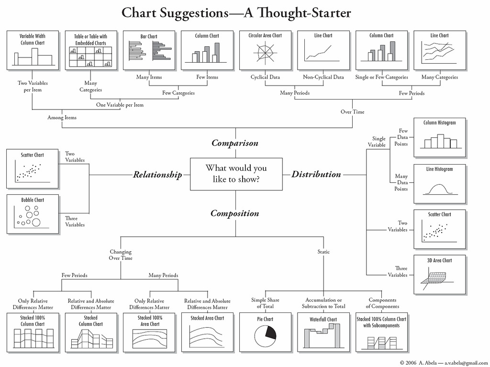

```{r setup, include=FALSE, cache=FALSE}
library(knitr)      # dynamic report generation, RMarkdown
library(ggplot2)    # data Viz
library(reshape2)   # long and wide format
library(data.table)   # long and wide format
library(dplyr)
options(width = 100)
opts_chunk$set(echo = TRUE, comment="", message=FALSE, warning=FALSE)
setwd("D:/Dropbox/~OnGoing/DSP/20160719 NTUST")
```

[Contact](mailto:snexuz@gmail.com)｜[Linkedin](http://tw.linkedin.com/in/rafechliu)


# 1. Data Visualization
- 清晰有效地傳達與溝通訊息
- 教學、研究、宣傳
- 美學、功能兼顧
- 統計圖形、訊息可視化

- [Chart suggestion](https://c4.staticflickr.com/4/3077/3196386402_01d8d12017_b.jpg)

<br>

</img>

<br>

# 2. The grammar of graphics: 

## 2.1. `library("ggplot2")`

- 當前最多人使用的視覺化R套件
- 取自 “The Grammar of Graphics” (Leland Wilkinson, 2005)
    - 由Hadley Wickham 於 2005 年發表 (Chief Scientist in RStudio)
- 設計理念
    - 採用圖層系統 (layer)
    - 用抽象的概念來控制圖形，避免細節繁瑣
    - 圖形美觀
    
## 2.2. 基礎語法
```{r eval=FALSE}
library(ggplot2)
ggplot(data = df, aes(x = x, y = y)) +
   geom_point()

```

- ggplot() - for fine, granular control of everything
    - data layer:
        - data = data.frame
        - long-format (`library("reshape2"`)
        - aes(x = x, y = y)
    - geom layer: geom_xxx(): 
        - multi-layers: `+`
        - Geometric objects that define the basic “shape” of the elements on the plot
- 必備的參考資料
    - [ggplot2 cheatsheet](https://www.rstudio.com/wp-content/uploads/2015/03/ggplot2-cheatsheet.pdf)
    - [ggplot2 online help topics](http://docs.ggplot2.org/current/)
    - [Cookbook for R](http://www.cookbook-r.com/Graphs/)

```{r}
library(ggplot2)
# list all geom
ls(pattern = '^geom_', env = as.environment('package:ggplot2'))
```

# 3. 實例演練

## 3.1 Histogram
```{r}
# hist(diamonds$price)
ggplot(diamonds, aes(x=price)) + 
  geom_histogram(binwidth=1000)

# with density function
ggplot(diamonds, aes(x=price)) + 
  geom_histogram(aes(y=..density..), binwidth=1000) +
  geom_density(color="red")
```

## 3.2 Barchart

- Plot by counting (default)

```{r}
# counts <- table(diamonds$clarity)
# barplot(counts, main="Car Distribution", 
#   	xlab="Number of Gears")

# by default, stat = "bin"
ggplot(diamonds, aes(x=clarity)) + 
  geom_bar()
```

- Use stat = "identity" argument

```{r}
tab <- data.frame(table(diamonds$clarity))
ggplot(tab, aes(x=Var1, y=Freq)) + 
  geom_bar(stat="identity")
```

- Add fill layer

```{r}
# change legend position
ggplot(diamonds, aes(x=clarity, fill=cut)) + 
  geom_bar(position="stack") + 
  theme(legend.position="bottom")

ggplot(diamonds, aes(x=clarity, fill=cut)) + 
  geom_bar(position="dodge") + 
  theme(legend.position="NULL")
```

- Change coord layer

```{r}
ggplot(diamonds, aes(x=clarity, fill=cut)) + 
  geom_bar() + coord_flip() +
  theme(legend.position="NULL") 
```

- Set theme layer

```{r}
g <- ggplot(diamonds, aes(x=clarity, fill=cut))
g + geom_bar() + coord_flip() + theme_bw() +
  theme(legend.position="NULL")
```

## 3.3 pie chart

```{r}
ggplot(diamonds, aes(x=clarity, fill=clarity)) + 
  geom_bar() 

ggplot(diamonds, aes(x="", fill=clarity)) + 
  geom_bar() + 
  coord_polar(theta = "y") 
```

## 3.4 Line chart


```{r}
library(dplyr)
head(economics)

econ <- economics %>% 
          mutate(year = strftime(date, format = "%Y"),
                 month = strftime(date, format = "%m"))

ggplot(econ, aes(x = date, y = unemploy)) +
  geom_line()

econ %>% filter(year %in% c("2010", "2011","2012", "2013", "2014")) %>%
  group_by(year) %>%
  ggplot(aes(x = month, y = unemploy, group = year, colour = year)) +
  geom_line()

```

## 3.5 Scatterplot

```{r}
g1 <- ggplot(mtcars, aes(x=wt, y=mpg, colour=cyl)) + geom_point()
g2 <- ggplot(mtcars, aes(x=wt, y=mpg, colour=factor(cyl))) + geom_point()
library(gridExtra)
grid.arrange(g1, g2, ncol=2)

# Add stat_xxx layer
ggplot(mtcars, aes(x=wt, y=mpg)) + 
  geom_point(color="red", size=5, alpha=0.5) +
  stat_smooth()

# Add scale_xxx layer
ggplot(mtcars, aes(x=wt, y=mpg, colour=gear)) + 
  geom_point(size=5) +
  scale_color_continuous(low="yellow", high="red")

```


## 3.6 facet_
```{r}
ggplot(mtcars, aes(x=mpg, y=disp)) + 
  geom_point(aes(colour=qsec, size=cyl, shape=as.factor(am))) + 
  facet_wrap(~gear) +
  scale_size(range=c(3,6))

```


# What's the next
- ETL => EDA => MODEL => `THESIS`
- Keep playing with R
    - ETL: dplyr, data.table, sparkR, ...
    - Interactive web applications: rmarkdown, plotly, highchart, shiny
    - Distributed computing: Rmpi, ...
    - Spatial Visualization: ggmap, ...
    - Web scraping: xml2, rvest...
  
<div style="text-align: center;">
<br> Thanks!<br>
Rafe C.H. Liu｜[Contact](mailto:snexuz@gmail.com)｜[Linkedin](http://tw.linkedin.com/in/rafechliu)
</div>

